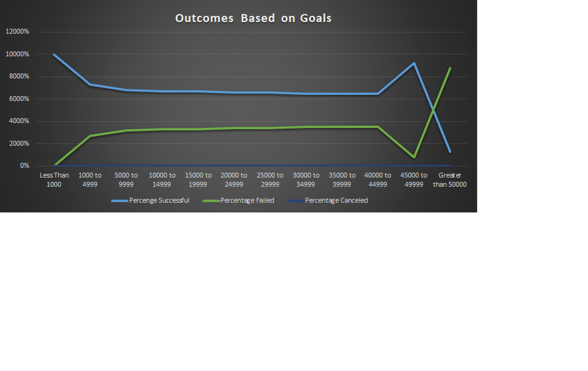
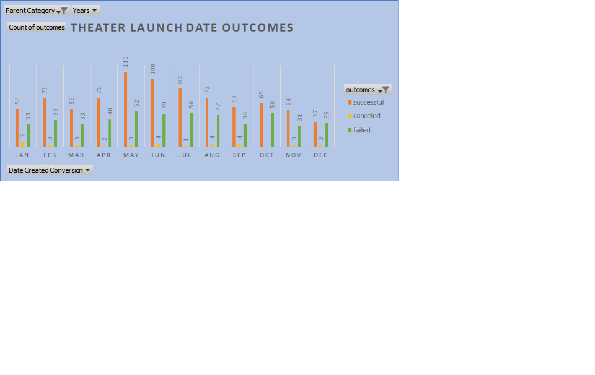

Preparing for the “Fever”

Overview
The data provided to you was broken into three categories Successful Campaigns, Failed Campaigns and Canceled Campaigns. For this analysis we will compare the three but focus mostly on successful and failed campaigns to determine what factors help ensure a successful campaign. Out of the ninety- six campaigns in this dataset only about 47% reached their funding goals. For this reason, it is important to know what could impact the outcome of the project before it is launched.

Preliminary Analysis
The Theatre Kickstarter projects were analyzed under two subcategories musicals and plays. Of these subcategories the total pledged mean amount was $5,602.00.  The median goal range of successful projects was $3,000.00.

Funding Goals
Setting a funding goal is a particularly important part of any project. This should be the minimum amount you are going to need to complete your project. For this reason, it is important you determine a budget first. The funding target for a successful Kickstarter in these subcategories is going to give you a guideline you will want to follow. The mean goal amount for all successful projects was $5,049.00. This amount was found by comparing the average amount in the Goals column but only using those amounts that had a successful outcome from the Outcomes column (see first chart below). 
Do larger goal amounts determine the success or failure of a campaign? 
As you would conclude the more a campaign needs to be funded the harder this will be on ensuring the success of the campaign. Failed Kickstart campaign goals were much higher than that of successful campaigns. Proving once again less is more. So, I would say that the higher the goal the higher possibility that the campaign could fail. The good news is that this did not seem to be the only determination of the success or fail of a campaign.

Determining a trend in Statuses based on launch dates.
Another factor that seems to play a role in the success of a campaign was the launch date. For this reason, I wanted to focus on comparing the statistics of the successful, failed, and canceled projects and their launch dates. This will help in discovering any trends or factors that will differentiate the outcomes of the projects. Since the goal is to launch a play here in the U.S., I decided to focus my research on the United States.

When is the Best Time of Year to Launch a project?
Knowing when to launch your project is an important factor. As shown on Outcomes Based on Launch Date Chart (see second chart below) you can see some months favor more success than others.
*Projects are exceptionally successful at one of the following points in time:
Best months (campaign launch): listed in order of success were: May, and June.
Worst month (campaign start) was December.
June, July, and October seemed to have around the same number of failed campaigns launched (see third chart below).

Some limitations found with this dataset.
Since the dataset did not focus on specific states in the U.S., it may have been beneficial to see if this also had a factor in the success of a campaign. Did some states do better at certain months of the year than other months? How were most states similar? As well as showing which states had higher success rates overall. All these factors could help in not only deciding when, but where in the U.S. is the best place to launch a campaign.

Conclusions
In my opinion and from the data I analyzed, I came up with three conclusions. 
Based on the launched dates of the campaigns:
1)What time of year seems to play a large role in the success of a campaign. If your campaign is not launched in the best month, it could cause the campaign to fail. May and June seem to have the best results for launching a successful campaign.
2)The percentage of Canceled Campaigns seemed to remain the same throughout the year.
Based on the outcomes of the goal amounts:
3) Failed Kickstarter campaigns had higher fundraising goals than that of successful campaigns. This did not seem to be the total cause of their failure. However, it may still pose a huge issue with the success of your campaign in the fact that you are asking for twice as much as the average Kickstarter goals found in this dataset.

I hope that you will find the information provided helpful to you in making the necessary moves to fulfil your goal in launching a successful play. Please let me know if there are any other questions, I could answer for you that would help you in your decision-making process.

![Theater_Outcomes_vs_Launch]Theater_Outcomes_vs_Launch.png

